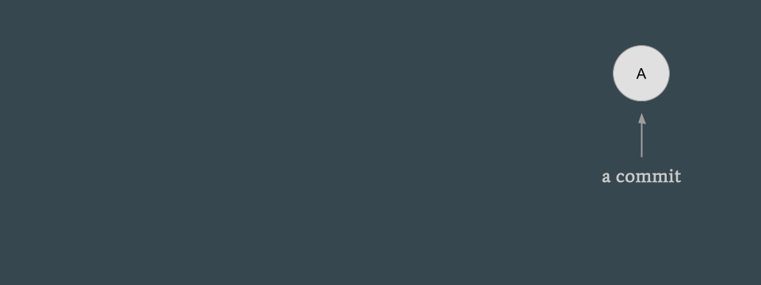
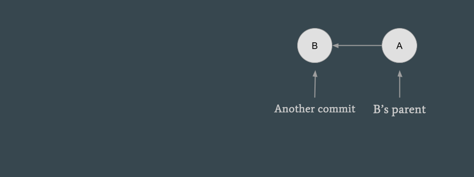
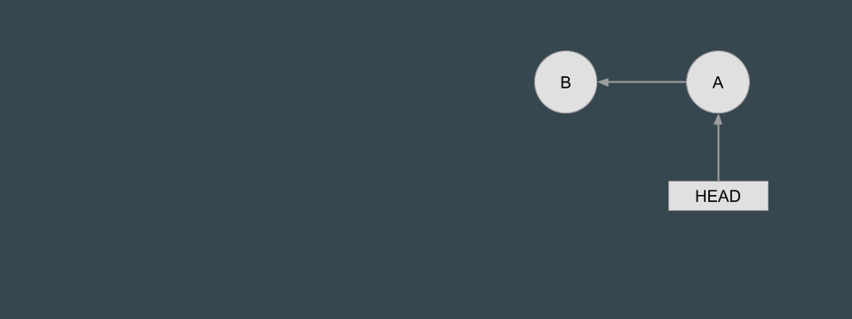
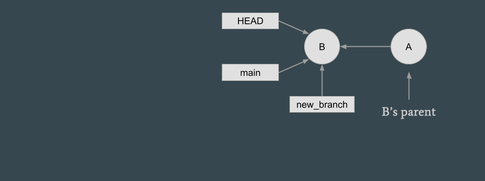
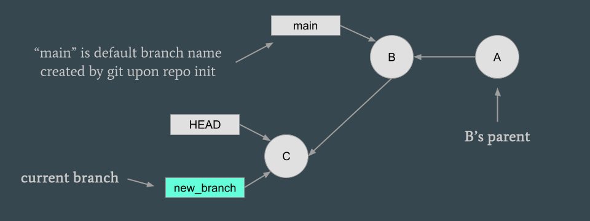
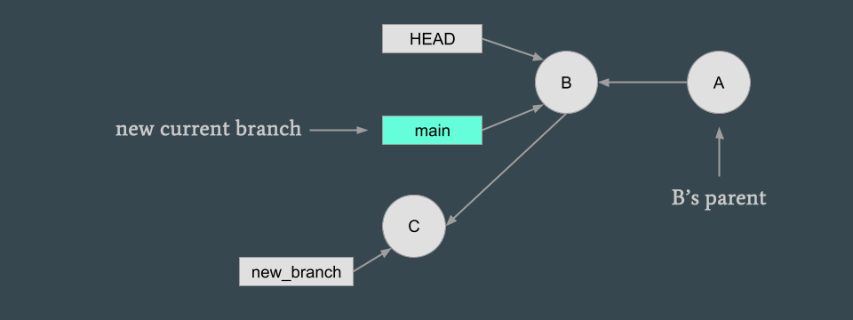
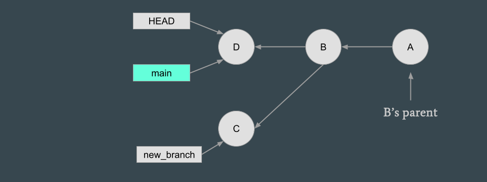
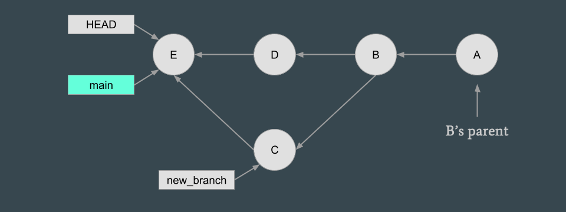

# {{ page.title }}
---

## What is version control software?

- Version control software (VCS) lets you and your collaborators track and document the changes you and they make to the contents of a directory over time
    - It can help with recalling who made what changes to files and directories over time (it's very helpful for tracking down the origins of bugs and who to ask about how to fix them--that person could be past you!)
    - It allows anyone to undo any changes anyone else has made to the contents of a project directory at any point in time

- VCS allows you and your collaborators to be working on different changes to the same code in parallel and then gracefully merge those changes later

- Most people these days use a VCS called [Git](https://git-scm.com) and share a Git **repository** (a directory and its associated change history) through a service called [Github](https://github.com)
    - Git represents changes to files and folders much more efficiently than other VCS's, so it can scale to large projects/codebases with many files and elaborate structures
    - Learning Git and Github are investments (not too much!), but will pay HUGE dividends for both you and your collaborators!

## Git abstractions

Before diving into the details of Git commands, it's important to understand the concepts that underly Git's system for tracking potentially parallel sets of changes to a project/codebase over time.

### Commits

Git tracks history of repository changes by letting users take snapshots of repository contents at a point in time called **commits**, which are identified by unique strings.

Every commit (except the first one) represents changes that were made to the repository *since a previous commit*, where that previous commit is called the current commit's **parent** commit.

Commits and the relationships between them are immutable: they can (almost) never be changed (this feature is nice because history can’t be tampered with). Because commits represent changes in the state of the repository and the current state of a repository can be reconstructed from just an initial state and a sequence of changes, only the initial commit needs to store the full state of the repository, and all subsequent commits only need to keep track of file and folder *differences* (often called "diffs") from their parent commits. As such, Git is a much lighter weight than competing VCS's that store successive snapshots of the entire state of a repository.

### References

Git automatically sets commit IDs to be uninformative strings of letters and numbers called *hashes*, so we instead use **references**, which are memorable aliases pointing to commits.

Unlike commits and their relationships, the commit a reference refers/points to can change. The special `HEAD` reference always points to the "current commit," namely the commit corresponding to the versions of the files and folders in the repository that are currently visible to you in the file system.

To undo a commit, just change the HEAD reference to refer to a previous (parent) commit, but *be careful*; you will lose the undone commit if you forget its ID.

### Branches

To work on new changes and still be able to refer to the commit those changes were based on, you can create a new **branch**, which is simply a new reference; you will see the value of this perhaps pointless-seeming functionality very shortly. Note that when a repository is initialized, Git automatically creates a `main` branch pointing to the first commit. In the diagram below, `new_branch` is a new branch.

Git keeps track of a **current branch** (highlighted in neon blue in the diagram below) (which is set to `main` when the repository is first intialized). When a new commit is made, the current branch reference is changed to point to that new commit along w/ HEAD. In the diagram below, when the new commit `C` is created and added as a child of commit `B`, the `HEAD` reference that was pointing to `B` is updated to point to `C`, and since `new_branch` is the repository's current branch and was pointing to `B` before, it is updated to point to `C` as well.

The beauty of Git is that you can change the current branch to a different branch so that new commits treat that branch as a reference instead; you can use this functionality to work on changes in parallel! In the diagram below, the current branch is changed back to `main`, so the `HEAD` reference is then set to point to commit `B` instead; as such, the files and folders in the repository will change to reflect their state as of commit `B`, but don't fear, if you switch the current branch back to `new_branch`, Git will switch the repository to reflect the changes you've made as of commit `C` again.

In the diagram below, when a new commit `D` is made, it treats commit `B` as its parent since `B` is the commit to which the `HEAD` reference points (not commit `C`, even though `C` was the previous most recent commit):

How do we bring these parallel work streams back together? Another beautiful feature of Git is that you can relatively seamlessly **merge** the changes made on another branch with the state of the repository represented by the current branch; doing so creates a new commit that represents the merge as illustrated in the diagram below. We'll talk later about the details of how those merges occur.

