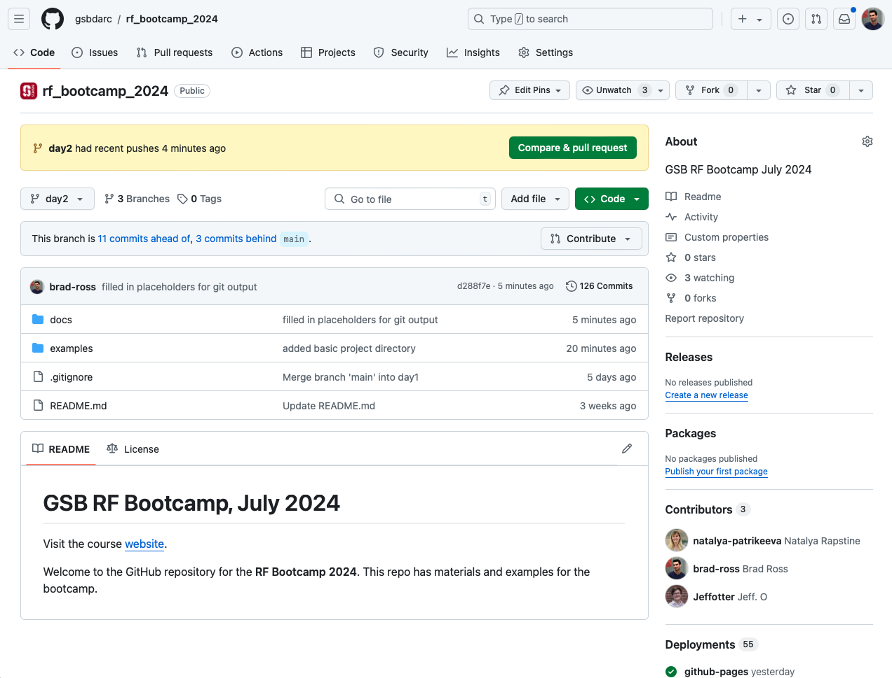
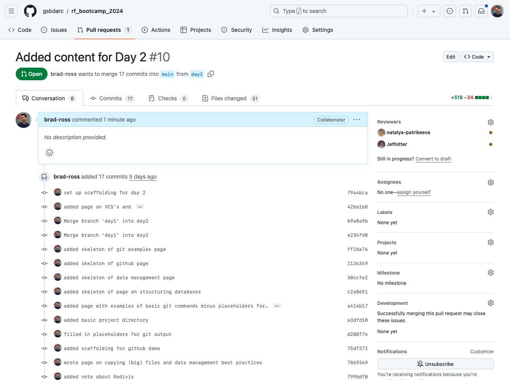
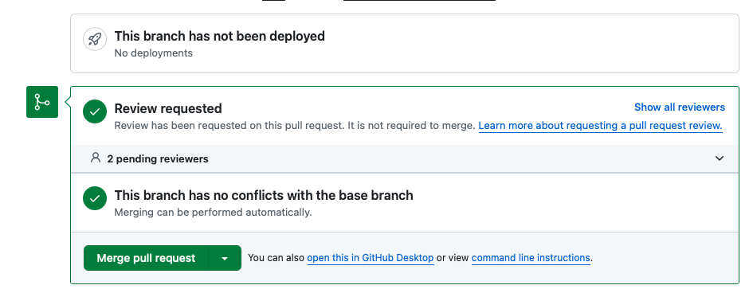
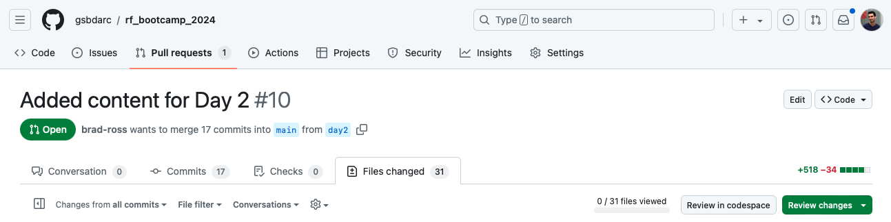
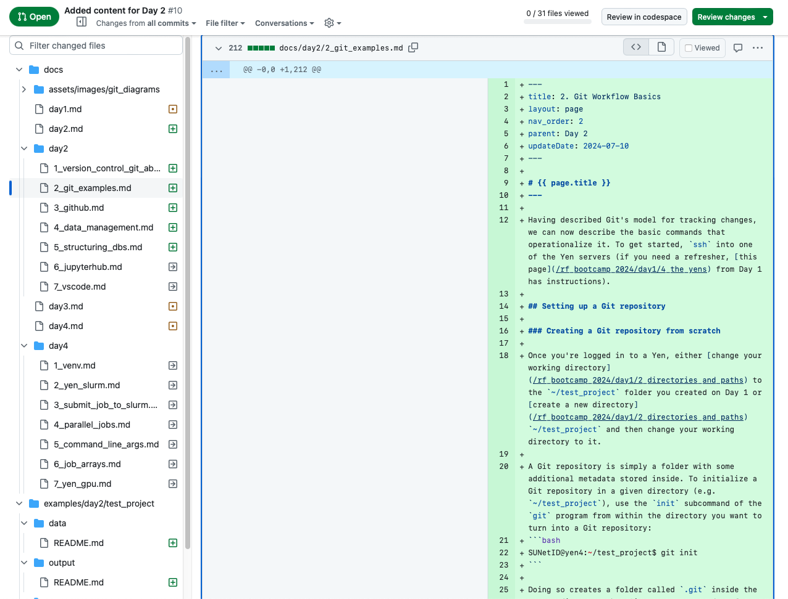
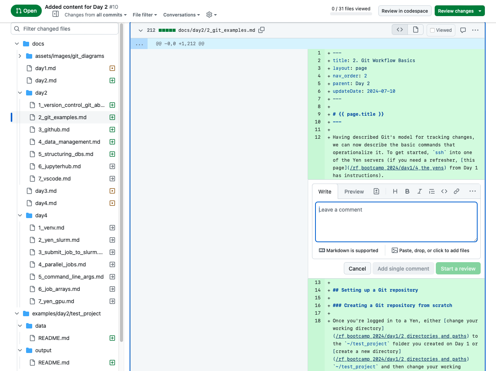
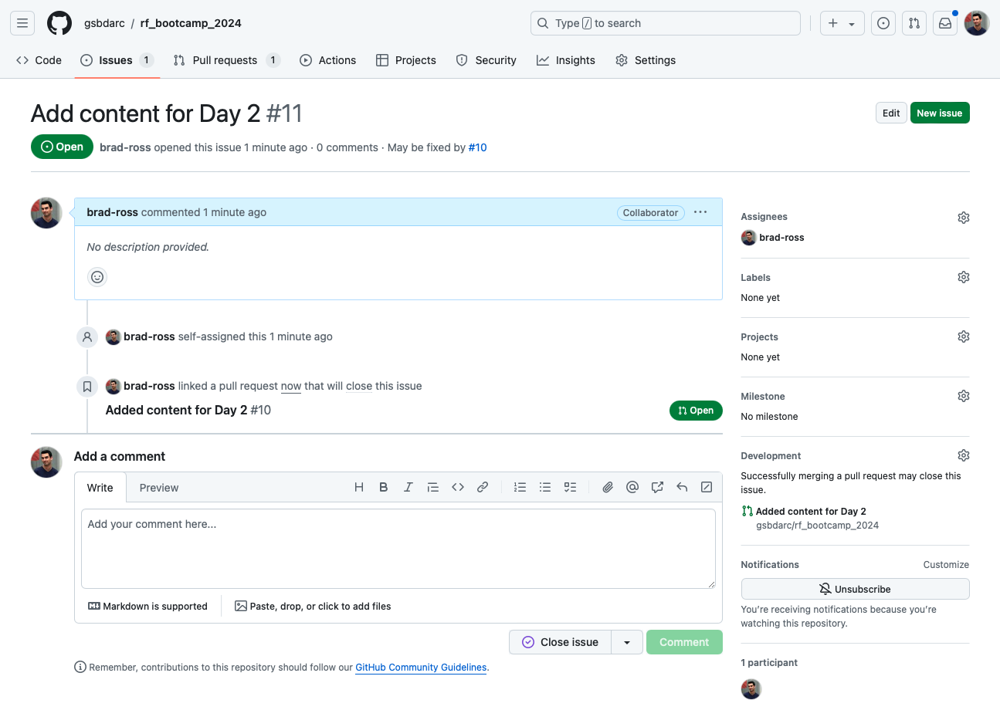

# {{ page.title }}
---

- A killer feature of Git we haven’t discussed is its support for remote repositories
    - A remote Git repository exists on a computer all collaborators have shared access to
    - Collaborators can pull their own private copies of the remote Git repository to their own computers
    - Each collaborator can make their own changes on their private repository copy, push those changes to the remote repository to share them with collaborators, and pull other collaborators’ changes down to their private repository copy

- [GitHub](http://github.com) is a popular platform ([but](https://bitbucket.org) [not](https://about.gitlab.com) the only one!) for hosting remote Git repositories that also provides useful tools/workflows for managing collaborations

- Today, there’s only time to give you a taste of what GitHub has to offer

## A quick Github repository tour

### Repository home

### Pull requests

A pull request is essentially a request for permission to merge a group of commits on a branch besides `main` into `main`. To preserve the `main` branch for code that is sure to "work," Github provides a workflow to allow collaborators to review changes on other branches before they get merged into `main`.

#### The basic view

#### The merge button

#### A view of the changes

#### Reviewing a pull request

### Issues

Issues are more free-form ways to keep track of tasks that need to be completed for the project that the repository represents. They can correspond to very concrete bugs to fix or be places to collect discussions about less concrete future work. A nice feature of issues is that you can link one to a specific pull request so that when that pull request is merged into `main`, the issue is closed automatically as well.

## More tutorials and resources

- Today, we could only give a brief overview of how GitHub can be used to make multi-person code collaborations much more productive
- Here are some resources from the comprehensive [GitHub help documentation](https://docs.github.com/en) that will help you get started with using GitHub for your own work:
    - [A “quickstart” tutorial](https://docs.github.com/en/get-started/quickstart) walking you step-by-step through a simple demo of GitHub features
    - [An overview](https://docs.github.com/en/get-started/quickstart/github-flow) of the intended “GitHub” workflow
    - [A tutorial](https://docs.github.com/en/get-started/getting-started-with-git/about-remote-repositories) on creating remote repositories on GitHub
    - [A tutorial](https://docs.github.com/en/pull-requests/collaborating-with-pull-requests/proposing-changes-to-your-work-with-pull-requests/about-pull-requests) on what pull requests are and how to make them
    - [An overview](https://docs.github.com/en/issues/tracking-your-work-with-issues/about-issues) of what GitHub issues are how to use them