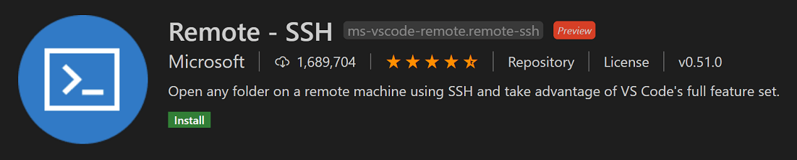
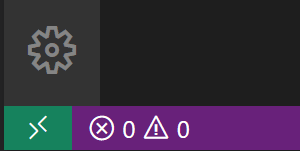
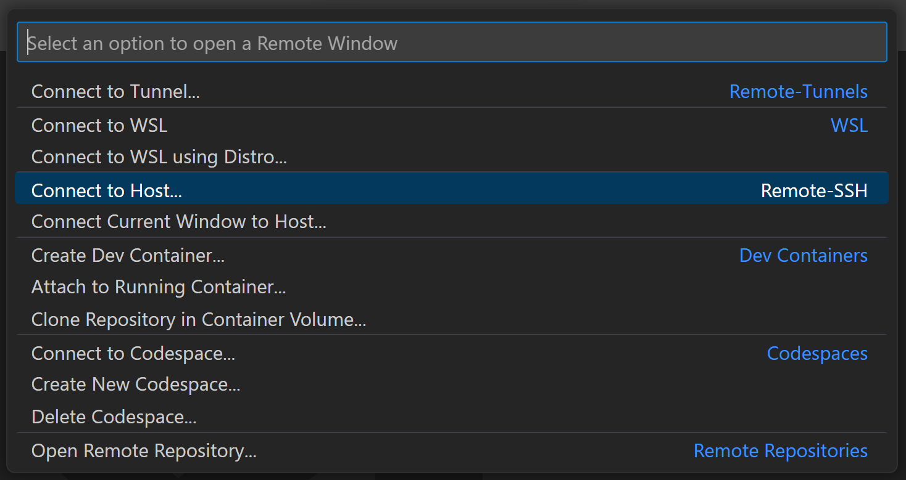
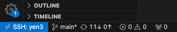
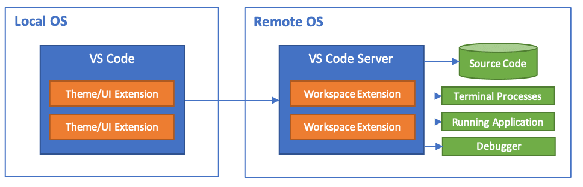

# {{ page.title }}

Visual Studio Code (or VS Code for short) is a popular Integrated Development Environment (IDE) used across various industries. Although our systems integrate with VS Code, there are some caveats to its' use in our current setup, which we will explain shortly. However, if you are committed to using VS Code, here's how to get started on our systems.

For new users, you can download VS Code from [here](https://code.visualstudio.com/). The tutorials provided will help you learn the basics and advanced features of VS Code. Once you have VS Code installed, follow these steps to begin remote development:

1. **Install the Remote-SSH Extension**:
    - Install the official [Remote-SSH extension](https://code.visualstudio.com/docs/remote/ssh-tutorial). This is crucial for connecting to remote systems.
    - Once installed, you should see an icon in the bottom left of your screen as shown below:

    

    - Follow the on-screen instructions, and once you have successfully installed the extension, your window should update as shown:

    

2. **Configure or Use an Existing Host**:
    - Click the green button in the bottom left corner of the screen as shown in the image above, or search for `> Remote-SSH: Connect to Host...` in the command palette.
    - You will be prompted to enter the host you want to connect to. Enter the following:

    ```bash
    username@yen3.stanford.edu # Replace with appropriate credentials and host (yen1-5)
    ```

    

3. **Authenticate and Connect**:
    - After selecting the host, you will be prompted to enter your password.
    - Following password entry, choose your preferred dual authentication method.
    - Once authenticated, you should see the status change in the bottom left of your screen:

    

4. **Initialize Your Environment**:
    - After connection, you should be able to to start working on your projects.
    - To ensure full functionality, as you would have in a regular SSH session, source your bash profile by running:

    ```bash
    bash -l
    ```

    - For a more permanent solution, add the following line to your Linux terminal profile in VS Code settings:

    ```json
    "terminal.integrated.profiles.linux": {
        "bash": {
            "path": "bash",
            "args": ["-l"]
        }
    }
    ```

5. **Start Working**:
    - You should now be able to execute all the commands you typically use in the terminal.
    - If you have any questions or need assistance, please reach out to our support team.

## Caveats
For VS Code to work seamlessly it installs a server on the remote machine. This server is installed in the first time you connect to the remote machine.



This server will take up space in your home and can be viewed by running the following command in your home directory after connecting to the remote machine:

```bash
ls -a
``` 
