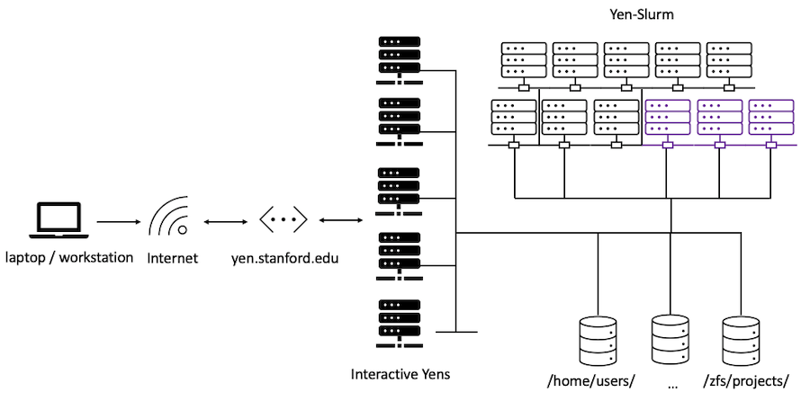

# {{ page.title }}
---
At the GSB, we have a collection of Ubuntu Linux servers (the `yen` cluster) specifically for doing your research computing work.
As a research fellow, you, by default already have access to these servers.
 They are administered by the <a href="https://srcc.stanford.edu" target="_blank">Stanford Research Computing (SRC)</a> and located in Stanford's data centers.

  
  



    

      <H1> </H1>
    

  

  

    

     
<i class="fas fa-tachometer-alt"></i> Current cluster configuration

<iframe class="airtable-embed" src="https://airtable.com/embed/shr0XAunXoKz62Zgl?backgroundColor=purple" frameborder="0" onmousewheel="" width="100%" height="533" style="background: transparent; border: 1px solid #ccc;"></iframe>
    

    

  

# Yen Computing Infrastructure
 
