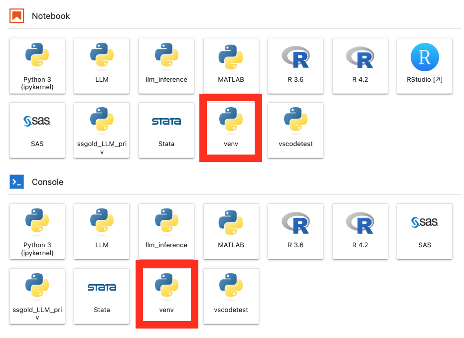
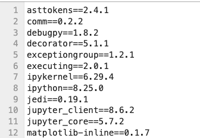

# {{ page.title }}
Python environments are a foundational aspect of professional Python development, allowing developers to isolate and manage Python packages and dependencies specific to individual projects or tasks. This isolation is crucial in maintaining a clean and organized development workspace, as it prevents conflicts between packages used in different projects. Furthermore, virtual environments ensure that projects are reproducible and can be shared with others without compatibility issues, as all the necessary dependencies are clearly defined and contained within the environment.

Managing Python virtual environments can be achieved through various tools, each offering unique features and benefits. The most commonly used tools include:

* `venv`: built into Python 3.3 and later. (Recommended)
* `virtualenv`: third-party tool that supports both newer and older Python versions, 
* [Anaconda](https://www.anaconda.com/products/distribution): third-party tool popular in data science,
* `Pipenv`: third-party tool that combines package management with virtual environment management.

The choice of tool often depends on the specific needs of a project and the preferences of a development team. For instance, `venv` is typically sufficient for straightforward Python projects, while `virtualenv` might be preferred for projects requiring compatibility with older Python versions or more granular control over the environment.

Regardless of the tool selected, the best practices for using Python virtual environments involve:
1. **Creating a New Environment for Each Project**: This ensures that each project has its own set of dependencies.

2. **Documenting Dependencies**: Clearly listing all dependencies in a requirements file or using a tool that automatically manages this aspect.

3. **Regularly Updating Dependencies**: Keeping the dependencies up-to-date to ensure the security and efficiency of your projects.

By adhering to these practices, developers can take full advantage of Python virtual environments, leading to more efficient, reliable, and maintainable code development.

### Best Practices on the Yens
**Recommendation: Utilizing venv for Python Environment Management**

We highly recommend using `venv`, Python’s built-in tool for creating virtual environments, especially in shared systems like the Yens. This recommendation is rooted in several key advantages that `venv` offers over other tools like `conda`:

* **Built-in and Simple**: `venv` is included in Python's standard library, eliminating the need for third-party installations and making it straightforward to use, especially beneficial in shared systems where ease of setup and simplicity are crucial.

* **Fast and Resource-Efficient**: `venv` offers quicker environment creation and is more lightweight compared to tools like `conda`, making it ideal for shared systems where speed and efficient use of resources are important.

* **Ease of Reproducibility**: `venv` allows for easy replication of environments by using a `requirements.txt` file, ensuring that the code remains reproducible and consistent regardless of the platform.

* **Terminal Agnostic**: `venv` will allow you to work in both JupyterHub Terminal, Linux Terminal, and Slurm through a single unified location


## Creating a New Virtual Environment with `venv`

Let's navigate to a project directory:

```bash
$ cd <path/to/project>
```
where `<path/to/project>` is the shared project location on ZFS.

Create a new virtual environment:

```bash
$ /usr/bin/python3  -m venv venv # Note venv is a customizable name
```
where we make a hidden directory `venv` inside the project directory. 

## Activating a New Virtual Environment 

Next, we activate the virtual environment:
```bash
$ source venv/bin/activate
```

You should see `(venv):` prepended to the prompt: 
```bash
(venv): 
```

Check Python version:

```bash
$ which python
/path/to/env/venv/bin/python
```

## Installing Python Packages within the New Virtual Environment
Install any python package with `pip`:

```bash
(venv) $ pip install <package>
```


## Making the Virtual Environment into a JupyterHub Kernel 
Install `ipykernel` package before installing the new environment as a kernel on JupyterHub:

```bash
$ pip install ipykernel
```

To add the **active** virtual environment as a kernel, run:
```bash
$ python -m ipykernel install --user --name=<kernel-name>
```
where `<kernel-name>` is the name of the kernel on JupyterHub.

Example 
```bash
$ python -m ipykernel install --user --name=venv
```



## Sharing the Environment

Environments can get quite large and take up lots of space depending on the project. An easy way to share them is you share the requirements.txt file which is a list of all the libraries and versions

```bash 
(venv)$  pip freeze > requirements.txt 
```
This will be different depending on which packages you install and can help users run the code you developed using that environment



To then replicated an environment onto another area, first create a new environment and install packages

```bash
$ usr/bin/python3 -m venv new_venv
$ source new_venv/bin/activate
(new_venv)$ pip install -r requirements.txt 
```

!!! warning
    Once the virtual environments are created they CANNOT be moved

### Deactivating the Virtual Environment
You can deactivate the virtual environment with:
```
$ deactivate
```

### Removing the Virtual Environment
If you would like to delete the previously created virtual enviroment, simply delete the environment directory since `venv` environment is essentially a directory containing files and folders. 

```
$ rm -rf .venv
```

If you created a Jupyter kernel you will also need to remove that with the following command from your home

```bash 
$ rm -r ~/.local/share/jupyter/kernels/venv
```

# Exercise
1. Navigate to examples/python_examples
2. Create a new virtual environment name **venv**
3. Activate the Environment
4. Install the packages in requirements.txt

<details>
<summary>Click for answer</summary>

```bash
$ cd examples/python_examples
$ python3 -m venv venv
$ source venv/bin/activate
(venv) $ pip install -r requirements.txt
```

</details>